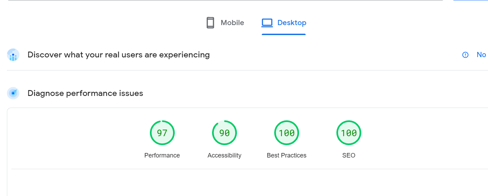
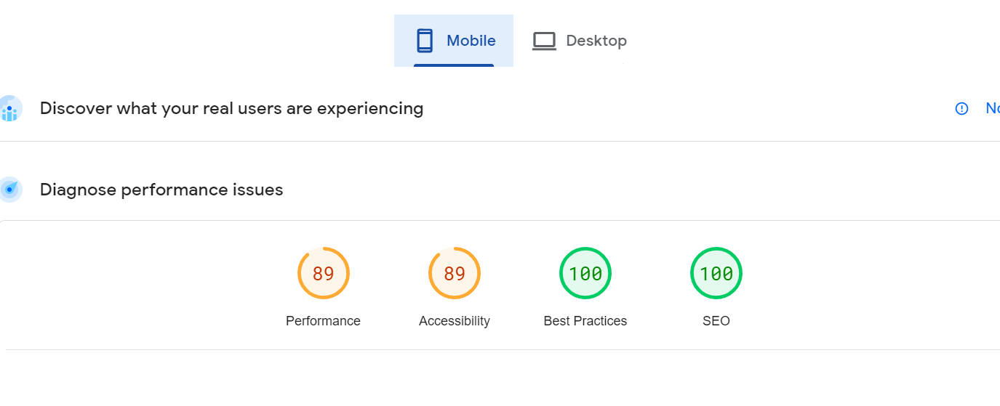

# ACM PDEU Website

A full stack website with backend embedded in the frontend for quick and easy access built with Next.js 13, SanityCMS v3, TypeScript and TailwindCSS.

[Video](https://www.youtube.com/watch?v=aImIpfH13oI)


<hr> 

## Features

- Light/dark mode toggle
- Sanity Backend in front-end only
- Next.js 13 Incremental Server Regeneration
- Authentication using NextAuth.js
- Blog entirely managed by SanityCMS and comments made in blogs need to be approved by the admin (who can access Sanity Backend), and then after approval, it takes 24 hours to reflect the comments back to the original site due to ISR

<hr>

## Design
- You can view the figma converted pdf by clicking the [link](https://drive.google.com/file/d/1xJrqldn9vDUGXKl3BvutXh6HGJACyPOr/view?usp=sharing)

<hr>

## Some important instructions

- In development mode, please uncomment the following line else it will throw an error
- This is located in the post/[slug]/page.tsx line 18
- Make sure once done, comment this line again as it is meant to disable next.js inbuilt error for authentication. However this error is not reproduced in production, so comment when deploying

```ts
// export const dynamic = "force-static";
```

- The backend of the site is embedded in the frontend itself and can be accessed by going to:
  `(base_url)/studio`

- But this is a protected route and can be accessed only by official PDEU ACM Mail account

- We are using ISR for fetching the blogs. You can view about ISR in detail. Currently the duration of ISR is set to 86400 seconds or 24 hours. 
- If you want to change it, you can do so by going to:
> src/app/post/[slug]/page.tsx; Line 16

<hr>

## Tech Stack

**Client:** Next.js 13, TypeScript, TailwindCSS, NextAuth.js

**Server:** Next.js 13 Server Components, Sanity CMS v3

**Other:** React hot toast, EmailJS, NextAuth.js, React Typewriter effect, Framer Motion

<hr>

## Installation

Clone the git repository in your local machine and cd to that location. Then run:

```bash
  npm install
  npm run dev
```

Also do not forget to make an .env.local file and put all the environments mentioned above in it.

**Also please if you create .env file make sure to add .env in gitignore**

**Make sure google client secret and sanity tokens are not pushed anywhere in public**

<hr>

## Environment Variables

To run this project, you will need to add the following environment variables to your .env file

`NEXT_PUBLIC_SANITY_PROJECT_ID`=1pnsxvns

`NEXT_PUBLIC_SANITY_DATASET`=production

`NEXT_PUBLIC_SANITY_API_VERSION`=2022-11-15

`SANITY_API_TOKEN`=sk9gDN8kA88gmv2y3IaMHEm9i6OhZM2kR8CgsxqXkUkewHUzQJn3tgyqCoHHicoPmJJCRwPVEaMB8jmQLoBezA9KEdnUC5Vjkm3WoXbqo1xLrWAKe7LR0XcoyvinGel0tPHtLKNfPoYZigoclnLRbUwaaHGTDHYcthem9Qph0t2GDg5tKBW4

`GOOGLE_CLIENT_ID`=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

`GOOGLE_CLIENT_SECRET`=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
<!-- For developement use localhost but for deployment use production/deployed url -->

`NEXTAUTH_URL`=http://localhost:3000/

`NEXTAUTH_SECRET`=devraj

<hr>

## Deployment

- The site could not be hosted on cpanel due to issues with middleware and ISR (dynamic content generation). However it would be great if it can be hosted without any compromises.

- For now its not happening but love to see it in future!

<hr>

## Performance in Lighthouse
For Desktop:



For Mobile:



<hr>

## How to add blogs and approve comments
- As we know we are using [Sanity](https://www.sanity.io/) for managing the content of the entire web app. Hence for better accessiblity we have embedded the entire Sanity Content Studio in the front-end itself.

- The route where the entire studio resides is [ACM Studio](https://acm-web.vercel.app/studio). But this is a protected route and hence can only be accessed by official ACM PDEU Account.

- To add a blog you can click on the Post section and click on the pencil icon to add a new blog and start filling in the content. Once done, just click on Publish and you should see the blog after 24 hours.

- Similarly the comments need to be approved in the studio and after 24 hours it will get reflected in the site.

<hr>

## Authors

- [@Devrajsinh-Jhala](https://github.com/Devrajsinh-Jhala)
